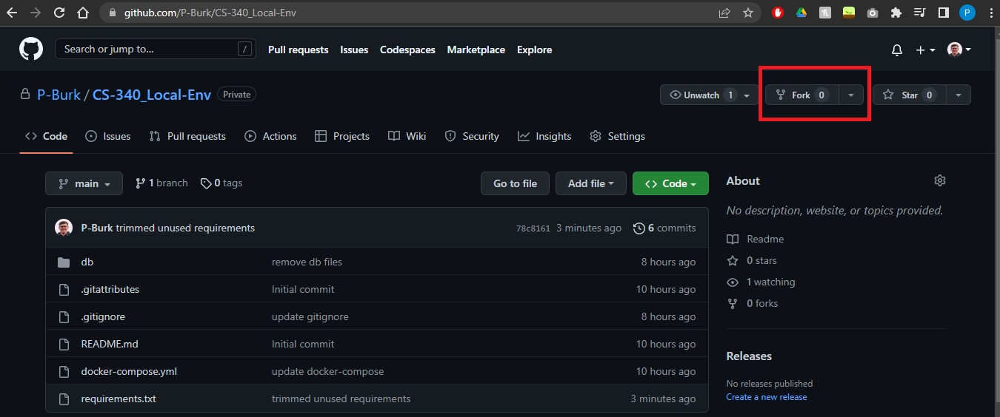
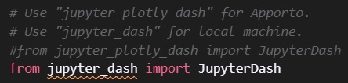
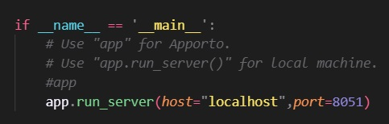

# Intent
I noticed that a lot of students have the same complaint that I did when taking CS-340. Apporto and Jupyter Notebooks are both a hassle to use. For one, Apporto has many issues ranging from slow/laggy connection to getting kicked off the instance before you can save your work. Jupyter Notebooks poses an issue in the fact that the version installed on the Apporto instance doesn't have useful IDE features such as error checking and code completion. A third problem arises when students try to install MongoDB locally. It's certainly doable, but I've seen complaints in multiple student run Discord servers that the process is almost not worth it. 

My hope is that students can fork this repository, get a local instance of MongoDB up and running, and be able to complete a vast majority of the class on their own machine using better tools such as VS Code, git, etc. 

If you encounter any issues, please report them using the issue feature in this repository, and we will work to get them fixed and updates pushed out. Thank you.

 

# Warning
As with all courses that utilize Apporto at SNHU, make sure your local files work in Apporto before submitting them for grading!! Many instructors use Apporto or have their own environments tuned to mimic the specific Apporto instance that they use to grade your coding assignments. 

 

# Requirements
### Docker
  - [Windows install instructions](https://docs.docker.com/desktop/install/windows-install/)
  - **NOTE**: be sure to also update you Linux kernel package and install a Linux Distro. These are steps 4 and 6 of the guide found [here](https://docs.docker.com/desktop/install/windows-install/). 
  

### Python
  - The class uses version 3.6.9, but for this guide/repo, I used 3.6.5.
  - [Python 3.6.5 downloads.](https://docs.docker.com/desktop/install/windows-install/)
  

### VS Code Extensions
  - [Docker](https://marketplace.visualstudio.com/items?itemName=ms-azuretools.vscode-docker)
  - [MongoDB for VS Code](https://marketplace.visualstudio.com/items?itemName=mongodb.mongodb-vscode)
  - [Python Extension Pack](https://marketplace.visualstudio.com/items?itemName=donjayamanne.python-extension-pack)
  - [Jupyter Extension Pack](https://marketplace.visualstudio.com/items?itemName=donjayamanne.python-extension-pack)

 

# Setup

### Fork the Repository

- Once you've forked the repository, clone your forked copy of the repository to your local machine.

### Set up Python Environment
- Open the repository in VS Code.
- Navigate to the Python extension and create a new virtual environment in your project folder.
- Update pip with the command:  
  `pip install --upgrade pip`
- Install required packages with the command:  
  `pip install -r requirements.txt`

 

# Commands/Usage/Tips
### Start the Docker Container
- Right click the `docker-compose.yml` file and select "Compose Up".

### Stop the Docker Container
- Right click the `docker-compose.yml` file and select "Compose Down". 
OR 
- Go to the Docker extension in the sidebar, right click the container, and select "Compose Down".

### Use the Mongo Shell
- Go to the Docker extension in the sidebar, right click the image being run (has a little green play icon), and select "Attach Shell".

### Dashboard Assignments and Jupyter Plotly
- In the dashboard assignments, I found that the `jupyter_plotly_dash` package did not work for me locally. A workaround for this is to comment out that specific import and import `jupyter_dash` instead.  
    
- This will cause you to get an error when `app` is called at the bottom of the notebook file. The workaround for this is to comment out `app` and add `app.run_server(host='localhost', port=<INSERT_PORT_HERE>)`.  
  

 

# FAQ

### Why did you map the MongoDB database in the project directory rather than letting Docker pick the volume location?
- I did this so that students would know exactly where the database is. This allows them to scrap the database files if needed or add/remove csv files used during the class.

### Why a Python Virtual Environment?
- This is to prevent conflicts on your own machine with packages you may already have installed. It's good practice to keep environments separate per what projects they belong to. You don't want to overwrite your up-to-date NumPy install that project A relies on with an older version needed for project B.

### How do I enable authentication for MongoDB?
- In the `docker-compose.yml` file, uncomment out the line that says `command: [--auth]`. Enabling/disabling authentication will require restarting the container (can use "Compose Restart").

### Why ignore the files in the mapped database folder?
- When the MongoDB image is running in the container, these files are updated very frequently, even if you aren't doing anything in the database. This will mark them as changed and ready for commits to whatever branch you are working on. Furthermore, issues can arise if you try to pull changes from one branch into another. These issues can cause the image to not load correctly/crash when you restart it. 
- If you'd like to commit database changes to your repository, feel free to, but I found during my time in the class that doing so was largely unnecessary as it created issues where I needed to revert to previous commits and dropping databases and/or users and re-adding them if I messed something up was an easier/simpler task.

